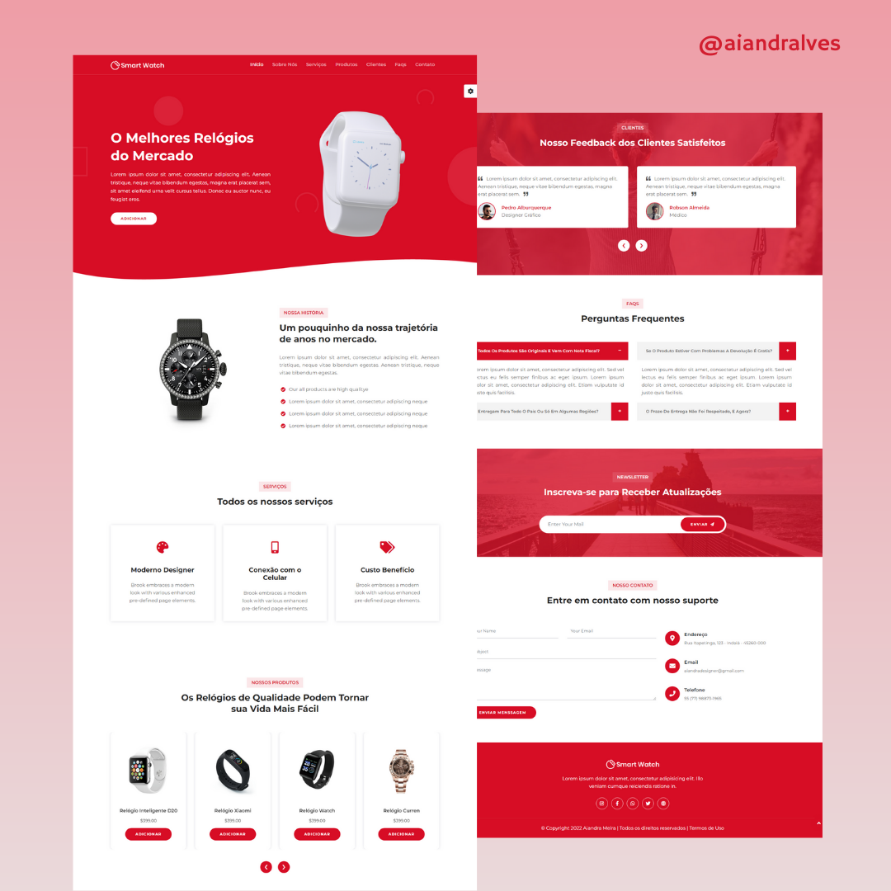

<h2 align="center"> 
	Smart Wacth 🚀❤️
</h2>

    

## 💻 Projeto

	Primeiro projeto de website desenvolvido, voltado para a apresentação e venda de smartwatches. A interface foca em design limpo, estrutura clara e boa usabilidade, com a possibilidade de mudar para as cores vermelha, roxo, azul e preto.

## ✨ Tecnologias

    
    
	
	

 

---

## 🤝 Contribuição

Faça um **fork** do repositório e se te ajudei de alguma forma, deixe uma 🌟

---

Feito com ❤ por Aiandra Meira 👋🏻 &nbsp;[Portfólio Pessoal](https://aiandralves.com)